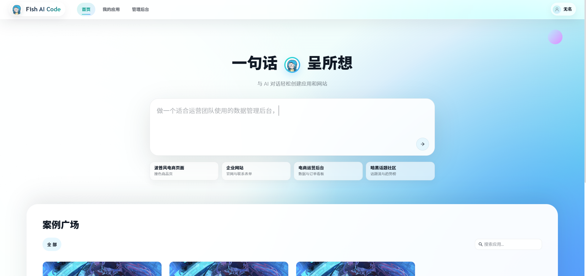
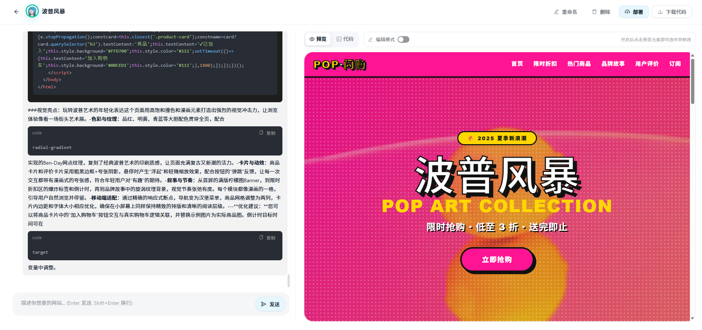
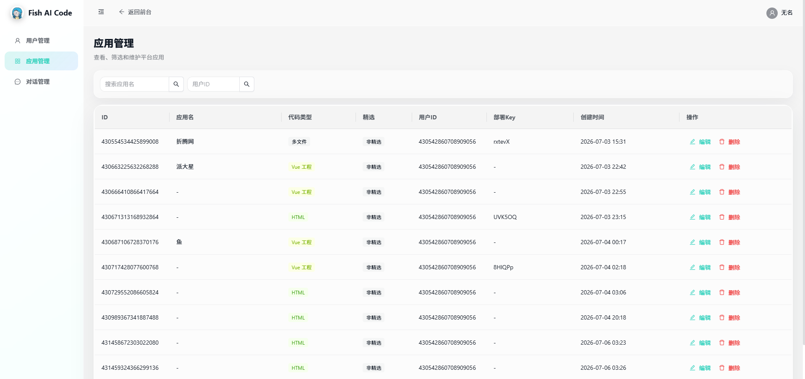

<div align="center">

# fish-ai-code

基于 AI 的智能代码生成与对话助手

<br>


<br>

[功能](#功能) • [截图](#截图) • [快速开始](#快速开始) • [技术栈](#技术栈)

</div>

---

## 功能

### AI 对话
通过自然语言与 AI 交互，支持流式 SSE 输出和多模型智能路由（DeepSeek / 通义千问）。

### 智能代码生成
AI 自动生成完整代码，支持三种模式：

| 模式 | 说明 |
|------|------|
| **单文件 HTML** | 快速生成独立 HTML 页面 |
| **多文件项目** | 生成包含 HTML/CSS/JS 的多文件结构 |
| **Vue 项目** | 工作流编排生成完整 Vue 项目，Docker 隔离构建，构建产物做完整性校验 |

### 项目下载与部署
生成的代码打包为 ZIP 下载，或一键部署到内置服务器。

### 用户与安全
注册登录、Redis 会话管理、角色权限控制（用户/管理员）、敏感词过滤；精选应用公开可见（未登录可浏览），对话/编辑仅创建者与管理员。

### 性能优化
- Redis 旁路缓存
- Redisson 分布式限流
- AOP 接口限流与权限校验

---

## 项目截图

#### 项目首页

#### 对话页面

#### 后台管理


---

## 快速开始

### 环境准备

| 依赖 | 版本 | 说明 |
|------|------|------|
| JDK | 21+ | 后端运行环境（构建链路用到虚拟线程） |
| Maven | 3.9+ | 后端构建（无 mvnw wrapper，使用系统 Maven） |
| Node.js | 20+ | 前端构建与开发 |
| MySQL | 8+ | 数据存储（执行 sql/create.sql 建库建表） |
| Redis | 7+ | 会话 / 缓存 / 分布式锁 / 限流（可无密码） |
| Docker | 20+ | **仅 Vue 项目生成需要**（隔离构建容器） |

### 第一步：初始化数据库

```bash
# 创建 fish_ai_code 库与 user / app / chat_history 三张表
mysql -u root -p < sql/create.sql
```

### 第二步：准备配置

后端通过 `application-local.yaml` 读取本地配置，但该文件已被 `.gitignore` 忽略（避免密钥入库）。**新环境需要从模板复制**：

```bash
# 复制模板为本地配置（模板含所有配置项与占位符说明）
cp src/main/resources/application-local.yaml.example src/main/resources/application-local.yaml

# 编辑 application-local.yaml，填入真实值：
#   - spring.datasource.password    MySQL 密码
#   - langchain4j.open-ai.*.api-key  DeepSeek API Key（4 处，可填同一把）
#   - （可选）pexels.api-key / undraw.token  图片搜索，不填则跳过图片收集
```

> DeepSeek API Key 在 [https://platform.deepseek.com](https://platform.deepseek.com) 申请。
> 如果不用图片搜索功能，Pexels / Undraw 配置可留空，不影响核心生成流程。

### 第三步：准备 Vue 构建镜像（仅 Vue 模式需要）

Vue 项目的构建在**隔离的 Docker 容器**中执行（`--network none` 离线构建），需要先构建一次基础镜像（预装依赖缓存）：

```bash
docker build -t fish-ai-code-vue-builder:20 -f docker/vue-builder/Dockerfile docker/vue-builder
```

> 只生成 HTML / 多文件模式可以跳过这步；用 Vue 模式前必须构建镜像，否则报"镜像不存在"。

### 第四步：启动后端（开发）

```bash
mvn spring-boot:run
```

后端默认监听 `http://localhost:8911/api`（context-path=/api）。

### 第五步：启动前端（开发）

```bash
cd fish-ai-code-frontend
npm install
npm run dev
```

前端默认 `http://localhost:3000`，Vite 已配置 `/api` 代理到后端 8911，开发期无需处理跨域。

### 访问

| 地址 | 用途 |
|------|------|
| `http://localhost:3000` | 前端页面 |
| `http://localhost:8911/api/doc.html` | 接口文档（Knife4j，可在线调试） |

---

## 生产部署

### 方式一：Docker Compose 一键部署（推荐）

整个项目（前端 + 后端 + MySQL + Redis）已打包为 Docker Compose 编排，**服务器只需装 Docker，3 步即可上线**：

```bash
# 1. 复制环境变量模板并填入真实密钥
cp .env.example .env
#    必填：DEEPSEEK_API_KEY（https://platform.deepseek.com 申请）
#    可选：DB_PASSWORD / REDIS_PASSWORD / PEXELS_API_KEY / UNDRAW_TOKEN / 端口等

# 2. 构建 Vue 隔离构建镜像（仅使用 Vue 项目生成需要，HTML/多文件模式可跳过）
docker build -t fish-ai-code-vue-builder:20 -f docker/vue-builder/Dockerfile docker/vue-builder

# 3. 一键启动（首次会自动拉取镜像、构建前后端、初始化数据库）
docker compose up -d --build
```

启动后访问 `http://<服务器IP>:80`（前端）、`http://<服务器IP>/api/doc.html`（接口文档）。

**Compose 包含的服务**：

| 服务 | 镜像 | 说明 |
|------|------|------|
| `frontend` | 自定义（node 构建 → nginx） | 托管前端静态资源，反代 `/api` 到后端（SSE 已关闭缓冲） |
| `backend` | 自定义（maven 构建 → JRE） | Spring Boot，配置全部环境变量化（application-docker.yaml） |
| `mysql` | mysql:8.0 | 首次启动自动执行 `sql/create.sql` 建库建表，数据持久化到 volume |
| `redis` | redis:7-alpine | 会话 / 缓存 / 分布式锁 / 限流 |

**常用命令**：

```bash
docker compose ps          # 查看状态
docker compose logs -f backend   # 查看后端日志
docker compose down        # 停止（保留数据）
docker compose down -v     # 停止并清空数据库数据（慎用）
docker compose up -d       # 重新启动（不重新构建）
```

> **Vue 构建说明**：后端容器通过挂载 `/var/run/docker.sock` 调用宿主机 Docker 运行隔离构建（`--network none`、只读、无内核能力），构建镜像需先在宿主机执行第 2 步的 `docker build`。由于 docker.sock 模式下 `--mount` 的 bind 源由宿主机 daemon 按宿主机文件系统解析，compose 已通过 `CODE_OUTPUT_HOST_DIR`（即 `${PWD}/data/code_output`）把宿主机代码输出根目录传给后端（`vue-build.host-code-output-dir`），后端会把构建命令的挂载源映射为宿主机绝对路径。
> **数据目录**：生成的代码在 `data/code_output/`，部署产物在 `data/code_deploy/`（已加入 .gitignore）。部署产物由 nginx 通过 `http://<主机>/deploy/{deployKey}` 提供访问（后端返回的部署链接即此格式）。

### 方式二：传统部署（手动）

#### 后端打包

```bash
# 打包（跳过测试）→ 生成 target/fish-ai-code-0.0.1-SNAPSHOT.jar
mvn clean package -DskipTests

# 启动（jar 包方式，与 mvn spring-boot:run 同配置）
java -jar target/fish-ai-code-0.0.1-SNAPSHOT.jar
```

#### 前端构建

```bash
cd fish-ai-code-frontend
npm install
npm run build   # 产物在 dist/
```

前端产物建议用 Nginx 托管，并将 `/api` 反向代理到后端：

```nginx
server {
    listen 80;
    root /path/to/fish-ai-code-frontend/dist;
    index index.html;

    # 前端路由（React Router）
    location / {
        try_files $uri $uri/ /index.html;
    }

    # 后端 API 反向代理
    location /api/ {
        proxy_pass http://127.0.0.1:8911;
        proxy_set_header Host $host;
        proxy_set_header X-Real-IP $remote_addr;
        proxy_set_header X-Forwarded-For $proxy_add_x_forwarded_for;
    }
}
```

#### 生产环境注意

- `application-local.yaml` 的 `server.address: 0.0.0.0` 允许外部访问，请确保防火墙 / 安全组只开放必要端口
- 代码生成目录 `tmp/code_output/` 与部署目录 `tmp/code_deploy/` 在启动目录下生成，建议给足磁盘空间
- 部署访问域名可在 `application.yaml` 的 `app.deploy.host` 配置（默认 `http://localhost`），Docker 方式在 `.env` 里配 `APP_DEPLOY_HOST`；部署链接格式为 `{host}/deploy/{deployKey}`，由 nginx 的 `location /deploy/` 服务

---

## 常见问题

| 问题 | 原因与解决 |
|------|-----------|
| 启动报 `Could not resolve placeholder 'spring.data.redis.password'` | application-local.yaml 缺失或未复制模板；按第二步复制并配置 |
| Vue 模式报"镜像不存在" | 未执行 `docker build -t fish-ai-code-vue-builder:20 ...`（Docker 方式见生产部署第 2 步） |
| `docker compose up` 报 `DEEPSEEK_API_KEY is missing` | 未复制 .env 或未填 key；`cp .env.example .env` 后填写 |
| `docker compose up` 报 502 / backend 未就绪 | 后端启动需约 10 秒（等 MySQL/Redis 健康检查），稍等重试；`docker compose logs -f backend` 查看 |
| 服务器访问不了前端 | 确认 `FRONTEND_PORT`（默认 80）已在防火墙 / 安全组放行 |
| 生成时提示"一分钟内请求次数过多" | 接口限流（默认 10 次/分钟），稍等再试或调大 `@RateLimit` |
| 生成的页面没有图片 | Pexels / Undraw key 未配置或无效，图片收集失败不影响代码生成 |
| 端口被占用 | 传统方式后端 8911 / 前端 3000；Docker 方式在 .env 中改 `BACKEND_PORT` / `FRONTEND_PORT` |

---

## 技术栈

<details open>
<summary><strong>后端</strong></summary>

- **Java 21** + **Spring Boot 3.5** — 核心框架
- **MyBatis-Flex** — ORM
- **MySQL 8** — 持久化存储
- **LangChain4j** — AI 模型统一接入（流式、多模型路由）
- **Redis** — 会话管理、旁路缓存
- **Redisson** — 分布式限流
- **Knife4j** — 接口文档
</details>

<details>
<summary><strong>前端</strong></summary>

- **React 19** + **TypeScript** + **Vite**
- **Ant Design 6** — UI 组件库
- **Zustand** — 状态管理
- **React Router 8** — 路由管理
- **React Markdown** + **React Syntax Highlighter** — 代码渲染与高亮
</details>

<details>
<summary><strong>AI 模型</strong></summary>

- **DeepSeek** — 默认对话与推理模型
- **阿里云百炼（通义千问）** — 智能路由分类任务
</details>

---

<div align="center">
  <sub>Built by hui fei de yu</sub>
</div>
